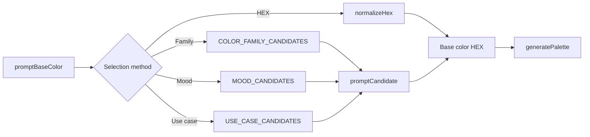

# Base Color Selection Development

This guide explains how to extend or change the Base color step without breaking the CLI flow or moving selection logic into the palette generator.

## Current design

The user can choose a base color in four ways:

1. Enter a HEX value.
2. Choose a color family, then a candidate.
3. Choose a mood, then a candidate.
4. Choose a use case, then a candidate.

Every path returns one normalized or predefined HEX string. The rest of the CLI does not need to know how that string was selected.



## Files involved

| File | Responsibility |
| --- | --- |
| `src/core/types.ts` | Category keys and the `ColorCandidate` shape |
| `src/core/constants.ts` | Fixed category-to-candidate tables |
| `src/core/color.ts` | HEX validation and normalization |
| `src/cli/prompt.ts` | Method selection, category selection, and candidate selection |
| `src/cli/index.ts` | Calls `promptBaseColor` initially and when the user chooses the base color again |
| `test/core/generate.test.ts` | HEX and generated-color invariants |
| `test/cli/prompt.test.ts` | Prompt selection behavior |
| `README.md` | User-facing explanation of available choices |
| `docs/ux-flow.md` | Implemented end-to-end interaction flow |

Keep the dependency direction `cli -> core`. Candidate data belongs in `core/constants.ts`; terminal labels and branching belong in `cli/prompt.ts`.

## Add a candidate to an existing category

For example, to add another candidate under the `calm` mood:

1. Open `MOOD_CANDIDATES` in `src/core/constants.ts`.
2. Add a `{ name, hex }` entry to the `calm` array at the position where it should appear in the CLI.
3. Use a short, user-facing name that distinguishes the candidate from its siblings.
4. Use canonical uppercase `#RRGGBB` for the stored HEX value.
5. Run the validation commands and manually open the mood path in the CLI.

```ts
calm: [
  { name: "Quiet Blue", hex: "#3B82F6" },
  { name: "Soft Teal", hex: "#0D9488" },
  { name: "Mist Green", hex: "#4D9C86" },
],
```

No prompt code change is needed. `promptCandidate` maps every entry in the array to a menu label automatically.

Check the candidate visually in at least monochrome and complementary modes. A technically valid color can still be a poor candidate if it is too close to an existing option or produces an indistinguishable palette.

## Add a category to an existing selection method

For example, to add `focused` as a mood:

1. Add `"focused"` to the `Mood` union in `src/core/types.ts`.
2. Add a `focused` property to `MOOD_CANDIDATES` in `src/core/constants.ts`.
3. Add at least one candidate to the new property.
4. Run `pnpm typecheck`. The `Record<Mood, ...>` type reports a missing table entry or a misspelled key.
5. Start the CLI and confirm that `Focused` appears in the expected position.
6. Update the Base color explanation in `README.md` if the documented examples should mention the new category.

Category menu order follows property insertion order in the candidate table. Put the new property where users should encounter it rather than appending it mechanically.

## Add a new base-color selection method

A new method is a larger UX change. Examples include selecting from a product theme or loading a project-specific preset.

1. Add a value to `BaseColorMethod` in `src/cli/prompt.ts`.
2. Add a user-facing option to the first menu in `promptBaseColor`.
3. Define the method's keys and candidate data in `src/core/types.ts` and `src/core/constants.ts` when the method uses fixed choices.
4. Add an explicit branch in `promptBaseColor` that always returns a valid HEX string.
5. Keep terminal interaction in `src/cli/prompt.ts`. Do not read input from `src/core`.
6. Keep the result deterministic. The same choices must return the same base color without network calls, time, or randomness.
7. Update `README.md` because the user will see a new choice.
8. Update the Mermaid flow in `docs/ux-flow.md`.
9. Add prompt tests covering the new route and its returned HEX value.

If the number of branches makes `promptBaseColor` difficult to scan, extract a method-specific prompt function. Do not move menu routing into `generatePalette`; generation should continue to receive only the final base color.

## Adjust candidate-selection logic

Use these boundaries when changing how a candidate is chosen:

- `selectKeys` turns table keys into a category menu.
- `promptCandidate` turns candidate objects into labels such as `Quiet Blue (#3B82F6)`.
- `select` handles TTY cursor selection and non-TTY numbered selection.
- `normalizeHex` validates direct input and returns uppercase `#RRGGBB`.

Changes to labels or ordering belong in the prompt helpers or candidate arrays. Changes to the fixed mapping between a concept and its colors belong in the candidate tables.

Do not infer a color dynamically from free-form mood or use-case text. The product behavior is intentionally based on visible, fixed choices. If free-form interpretation is introduced later, treat it as a new selection method with its own validation, failure behavior, tests, and UX documentation.

Candidate table values currently bypass `normalizeHex` because they are trusted constants. When adding a new data source or accepting external values, normalize at that boundary before returning the base color.

## Testing changes

Add tests at the narrowest relevant level:

- Candidate-only change: verify stored candidate HEX values are valid and smoke-test the changed menu.
- New category: verify it appears in the category table and can return one of its candidates.
- New method or routing change: test `promptBaseColor` with a fake `PromptInterface` that supplies the expected sequence of selections.
- HEX behavior change: extend the `HEX handling` tests in `test/core/generate.test.ts`.
- Selection-control change: extend `test/cli/prompt.test.ts` and verify both cursor and numbered modes.

Run the full validation set:

```bash
pnpm test
pnpm typecheck
pnpm build
```

Then run `pnpm start` and check this interaction manually:

1. Open the changed Base color route.
2. Move through choices with Up and Down.
3. Confirm with Enter.
4. Verify the selected name and HEX value.
5. Complete harmony and neutral selection.
6. Inspect the preview for the intended direction.
7. Choose `Choose the base color again` and confirm the route works on the second pass.

Also exercise numbered input if the shared `select` behavior changed.

## Review checklist

- All stored candidate colors use uppercase `#RRGGBB`.
- Names are understandable without reading source code.
- New choices are not visually redundant with adjacent choices.
- The selected path always returns a valid base-color HEX string.
- Candidate data remains separate from terminal control flow.
- Core generation remains independent of standard input and output.
- TTY and non-TTY selection still work.
- README examples match the choices users see.
- `docs/ux-flow.md` matches any changed interaction path.
- Tests, type checking, and build all pass.
