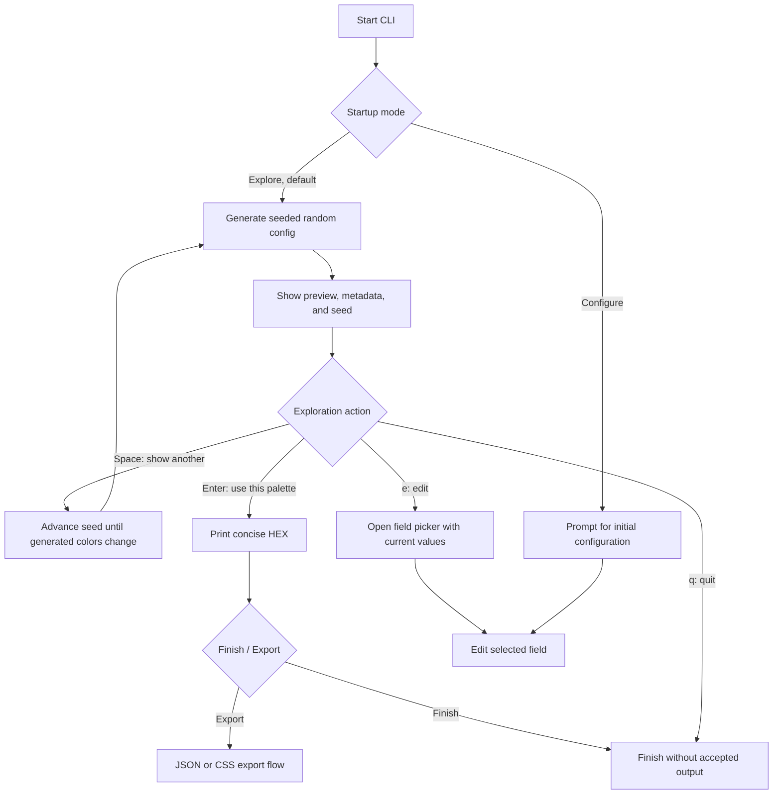
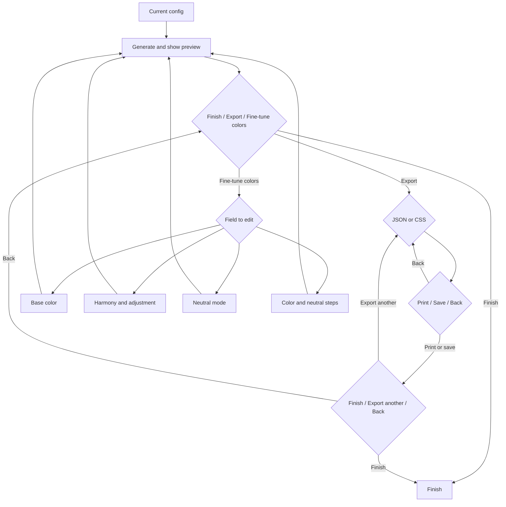
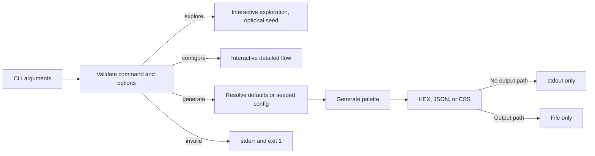
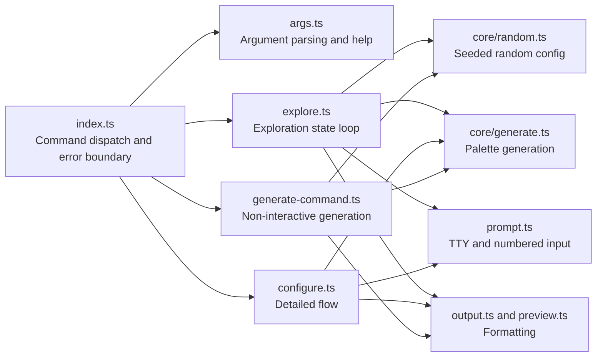

# CLI UX Flow

This document describes the implemented interactive and non-interactive journeys.

## Startup and exploration

Running the CLI without a command opens a two-item menu with exploration selected:

```text
> Browse palettes - See a new random palette each time
  Build your own - Choose colors and settings
```



Random exploration changes the curated base color, harmony, harmony adjustment, and neutral mode. Color and neutral step counts remain fixed at five. The displayed eight-digit seed reproduces the candidate through `generate --seed` within the same Quick Palette version; generated JSON output should be retained when exact colors are required across versions.

TTY exploration reads a single key and restores raw mode after success, cancellation, or error. It displays `Enter: use this palette / Space: show another / e: edit / q: quit`. Non-TTY input uses a numbered `Use this palette / Show another / Edit / Quit` menu and never waits for raw key events.

## Detailed configuration

Fresh configuration asks for base color, harmony, harmony adjustment, and neutral mode. The adjustment question is skipped for monochrome palettes because it has no visual effect. Editing an exploration candidate opens the field picker immediately and preserves its current values.



Finish keeps the palette and exits without repeating the HEX values already shown in the preview. The normal path keeps both step counts at five and asks no step-count or output questions. JSON is described as full palette data and settings; CSS as ready-to-use custom properties. Both use the same Print, Save, and Back choices, then offer Finish, Export another format, or Back to palette without reprinting the preview. Fine-tune colors preselects current values and changes only the selected field group.

## Non-interactive commands



`generate` creates no readline interface and prints no headings or prompts beyond the requested format. With no seed, omitted fields use `#2563EB`, analogous harmony, mechanical tuning, neutral gray, and five steps. With a seed, omitted configurable fields come from the deterministic random configuration; explicit flags pin their fields.

## Selection and terminal behavior

- TTY menus use Up and Down with wraparound and Enter to select.
- Exploration uses Enter, Space, `e`, and `q` as direct actions.
- Ctrl+C prints `Cancelled.`, exits with status 130, and restores raw terminal mode.
- Terminal palettes use **Color scales**, **Scale 1**, and **Neutral scale** headings with `100` through `900` labels in light-to-dark order.
- Tetradic and Pentadic harmonies produce four and five color groups respectively.
- Fine-tune colors is available from the edit menu without adding prompts before the first preview.
- Analogous distance, hue rotation, and chroma scale are validated at both CLI and core boundaries.
- Non-TTY menus use numbered input and reject invalid selections.
- True Color swatches appear only for TTY stdout when `NO_COLOR` is unset.
- Machine-readable generation writes content to stdout or a selected file, and errors to stderr.

## Interaction counts

The implemented paths were checked through automated process tests and timed non-TTY internal trials on 2026-06-21 using Node.js 26.3.0. Counts exclude typing the launch command; timings are local smoke measurements, not performance targets.

| Journey | First preview | Accept and finish | Internal wall time |
| --- | ---: | ---: | ---: |
| No arguments, default exploration | 1 selection | 3 key actions total | 0.11 s |
| `explore` command | 0 selections | 2 key actions total | Not timed |
| `explore --seed 8f3a21c4` | 0 selections | 2 key actions total | 0.12 s |
| `generate --seed 8f3a21c4` | No preview step | 0 interactive actions | 0.10 s |

Moving between exploration candidates requires one Space key. Accepting requires one Enter key followed by a **Finish** or **Export** selection; **Finish - Keep this palette and exit** is preselected. External first-time-user usability sessions have not yet been conducted.

## Module responsibilities


