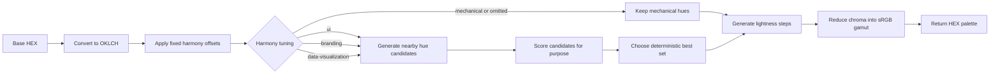

# Perceptual Harmony Implementation Plan

## Status

Implemented. The CLI and core behavior described here are available, with Mechanical remaining the compatibility default.

## Goal

Add an optional, deterministic adjustment step for harmony hues while preserving the current fixed-angle behavior exactly.

The adjustment will support only these purposes:

- `ui`
- `branding`
- `data-visualization`

Illustration and editorial are excluded because their desired results depend too heavily on art direction and surrounding content. Accessibility is excluded because hue adjustment alone cannot guarantee contrast, color-vision accessibility, or compliance with an accessibility standard.

## Compatibility requirements

The current behavior is the compatibility baseline and will be called `mechanical`.

- Existing callers that do not specify an adjustment must receive byte-for-byte identical palette output.
- The CLI must continue to default to `mechanical`.
- Current hue offsets in `HUE_OFFSETS` must not be changed.
- Perceptual adjustment must be opt-in.
- Both modes must remain deterministic and must not use AI, randomness, network access, or runtime environment data.
- Gamut mapping must remain the final color-safety step.

## Proposed configuration

Add a single optional setting rather than separate mode and purpose fields. This avoids invalid combinations such as `mechanical` with a perceptual purpose.

```ts
export const HARMONY_TUNINGS = [
  "mechanical",
  "ui",
  "branding",
  "data-visualization",
] as const;

export type HarmonyTuning = (typeof HARMONY_TUNINGS)[number];

export interface PaletteConfig {
  // Existing fields omitted
  readonly harmonyTuning?: HarmonyTuning;
}
```

An omitted value resolves to `mechanical`. Keeping the field optional allows existing TypeScript callers and saved configurations to continue working. A later major version may make the field required after consumers have migrated.

## Processing pipeline



The mechanical offset is always the starting point. Perceptual tuning may make only a bounded local adjustment; it does not replace the selected harmony with an unrelated set of hues.

## Adjustment model

### Candidate generation

For each non-base harmony hue, generate candidates around its mechanical target. The initial search window should be deliberately small:

```ts
const PERCEPTUAL_HUE_SHIFTS = [-12, -8, -4, 0, 4, 8, 12] as const;
```

Rules:

- Keep the base hue unchanged.
- Keep monochrome unchanged because it has no secondary harmony hue.
- Normalize every candidate to the `0 <= H < 360` range.
- Use a fixed candidate order so ties always resolve identically.
- Do not adjust lightness in the hue-selection stage.
- Keep chroma policy separate from hue selection in the first implementation.

The search window and candidate list are implementation constants, not user settings. They can be tuned later with golden test updates and documented evaluation results.

### Shared scoring inputs

Score colors at a representative middle lightness rather than scoring every generated step. Use the same base chroma policy as palette generation, then map candidates into sRGB before measuring them. This makes gamut loss visible to the scorer.

The scorer may use:

- Circular hue distance from the mechanical target.
- Pairwise OKLCH distance between harmony colors.
- Chroma retained after sRGB gamut mapping.
- Penalties for candidates that collapse to nearly indistinguishable mapped colors.

Do not label raw hue-angle separation alone as perceptual scoring. At least mapped OKLCH distance or chroma retention must contribute to every purpose-specific score.

## Purpose definitions

### UI

Objective: create restrained supporting and accent hues for product interfaces without drifting far from the selected harmony.

Scoring priorities:

1. Stay close to the mechanical target.
2. Avoid secondary colors that lose substantial chroma during gamut mapping.
3. Maintain enough mapped color difference for states and accents to be distinguishable.
4. Prefer the smaller absolute hue shift when scores tie.

UI tuning does not calculate text contrast. Contrast validation requires a foreground/background pair and belongs in a separate feature.

### Branding

Objective: preserve a clear, expressive relationship between the primary hue and secondary brand accents.

Scoring priorities:

1. Retain chroma after gamut mapping.
2. Maintain strong mapped separation from the base color.
3. Keep the set balanced so one secondary hue does not collapse toward another.
4. Apply a smaller penalty for deviation from the mechanical target than UI tuning.

Branding tuning should still respect the bounded search window. It is not an automatic brand-identity generator.

### Data visualization

Objective: make categorical series easier to distinguish from one another within the selected harmony.

Scoring priorities:

1. Maximize the minimum pairwise mapped OKLCH distance across the set.
2. Penalize any pair that falls below a documented minimum-distance threshold.
3. Retain usable chroma after gamut mapping.
4. Use distance from the mechanical target only as a tie-breaker.

This option is intended for categorical distinction, not sequential or diverging data scales. It does not guarantee accessibility for color-vision deficiencies; that requires dedicated simulation and non-color encodings such as labels, shapes, or patterns.

## Proposed code structure

Add the adjustment as a core-only pure function:

```text
src/core/
  perceptual-harmony.ts   Candidate generation and purpose scoring
  constants.ts            Search shifts, limits, and scoring weights
  types.ts                HarmonyTuning
  generate.ts             Calls the tuner after mechanical hue selection
```

Suggested public boundary:

```ts
interface TuneHarmonyInput {
  readonly base: OklchColor;
  readonly harmony: HarmonyMode;
  readonly mechanicalHues: readonly number[];
  readonly purpose: Exclude<HarmonyTuning, "mechanical">;
}

function tuneHarmonyHues(input: TuneHarmonyInput): readonly number[];
```

Keep scoring helpers internal until a concrete reuse case exists. Return hue values only; lightness-step generation and final HEX conversion remain in `generate.ts`.

## CLI flow

When the core behavior is stable, add a prompt after Color harmony:

1. `Mechanical (current behavior)`
2. `UI`
3. `Branding`
4. `Data visualization`

The preview must display the selected tuning. Choosing the harmony again should also ask for tuning again because the adjustment depends on the harmony. A separate review action for tuning can be considered later, but is not required for the first release.

README descriptions should focus on expected use, not scoring formulas. Update `docs/ux-flow.md` with the additional prompt and review behavior when implementation begins.

## Delivery phases

### Phase 1: Freeze the compatibility baseline

- Add golden tests for representative base colors in all four harmony modes.
- Cover low-chroma, high-chroma, warm, cool, and hue-wraparound inputs.
- Assert that omitted tuning and explicit `mechanical` produce identical results.

### Phase 2: Add core types and candidate generation

- Add `HarmonyTuning` and the optional config field.
- Add bounded candidate generation and deterministic tie handling.
- Keep `generatePalette` behavior unchanged for mechanical mode.

### Phase 3: Implement purpose scoring

- Implement one scorer per supported purpose.
- Document weights and thresholds beside their constants.
- Add unit tests for score ordering and edge cases.
- Add integration tests confirming valid in-gamut HEX output.

Implement `ui` first, then `branding`, then `data-visualization`. The data-visualization scorer has the strongest set-level requirements and should not be used as the first proof of the abstraction.

### Phase 4: Evaluate fixtures

- Build a fixed evaluation matrix of base hues and chroma levels.
- Record mechanical and tuned outputs for side-by-side review.
- Reject weight changes that improve a few hand-picked examples while causing broad regressions.
- Store accepted outputs as versioned test fixtures.

Human review is appropriate for approving fixed fixtures. Human preference must not be consulted at runtime.

### Phase 5: Add CLI and documentation

- Add the tuning prompt and preview label.
- Preserve mechanical as the initial selection.
- Update README user guidance.
- Update the UX flow document.
- Test TTY cursor selection and non-TTY numbered input.

## Test requirements

### Compatibility

- Existing tests pass without fixture changes.
- Existing configs without `harmonyTuning` return their current colors.
- Explicit mechanical mode matches omitted mode exactly.

### Determinism and invariants

- Repeated input returns identical tuned hues and HEX colors.
- The base hue remains unchanged.
- Monochrome remains unchanged.
- Hue shifts never exceed the configured search bound.
- All output remains valid in-gamut sRGB HEX.
- Ties resolve consistently.

### Purpose behavior

- UI chooses a less gamut-destructive candidate when mechanical distance is otherwise comparable.
- Branding favors chroma retention and strong base-to-accent separation.
- Data visualization improves or preserves the minimum pairwise mapped distance compared with other candidates in its search set.

Tests should verify scoring properties and accepted fixtures rather than asserting that a palette is universally beautiful.

## Acceptance criteria

The feature is ready only when all of the following are true:

1. Mechanical output is unchanged for every compatibility fixture.
2. Each supported purpose has a documented, deterministic scoring function.
3. Adjustments remain within the fixed local search bound.
4. Tuned output is valid sRGB HEX and deterministic.
5. Data-visualization wording does not claim color-vision accessibility.
6. The CLI defaults to mechanical and clearly labels all options.
7. README and UX documentation match the implemented interaction.
8. Unit, integration, type-check, build, TTY, and non-TTY checks pass.

## Explicit non-goals

- Illustration-specific art direction.
- Editorial palette selection based on photography or content.
- Accessibility certification or WCAG contrast guarantees.
- Color-vision-deficiency simulation.
- Sequential, diverging, or continuous data scales.
- AI-generated or free-form semantic color selection.
- User-configurable scoring weights in the first version.
