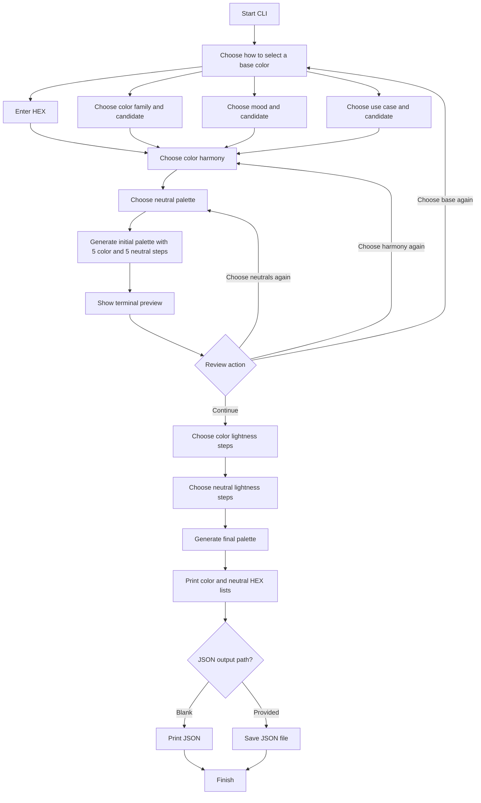
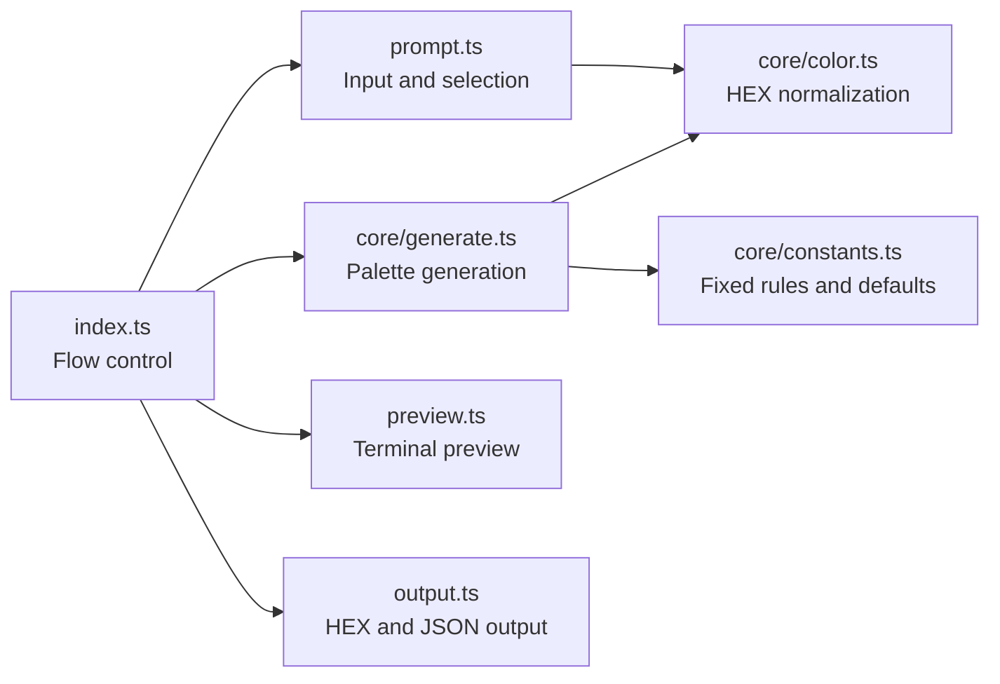

# CLI UX Flow

This document describes the user journey implemented by `src/cli/index.ts` and the modules involved at each stage.

## End-to-end flow

## Selection behavior

In a TTY, `src/cli/prompt.ts` renders a cursor beside the active option. Up and Down wrap around the available choices, and Enter returns the selected value. Step prompts start on their configured default, which is 5 for both colors and neutrals.

When standard input or output is not a TTY, selection falls back to numbered input. Invalid numbers are rejected and prompted again. Direct HEX input accepts `#RGB` and `#RRGGBB`; invalid values are also prompted again.

## Preview and revision loop

The first preview is generated only after the base color, harmony, and neutral style are known. `src/core/generate.ts` creates the palette, while `src/cli/preview.ts` formats it. True Color blocks are shown only when the output is a TTY and `NO_COLOR` is not set.

The review menu changes one decision at a time:

- Changing the base color returns to the base selection method.
- Changing harmony preserves the base color and neutral style.
- Changing neutrals preserves the base color and harmony.
- Continuing moves to the final lightness-step choices.

After any revision, the initial palette is regenerated and previewed again.

## Final generation and output

The selected color step count applies to every hue in the harmony. For example, analogous harmony has three hues, so 5 steps produce 15 color swatches. Neutral steps always describe the total number of neutral swatches.

`src/cli/output.ts` prints the final HEX lists with the same TTY True Color swatches used by the initial preview. It then either prints formatted JSON or writes it to the path entered by the user. Errors propagate to the CLI entry point, which prints a failure message and sets a non-zero exit code.

## Module responsibilities

